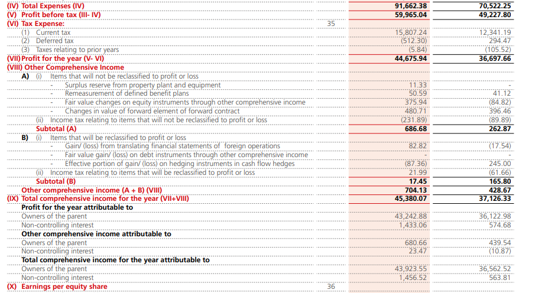

**Non-Controlling Interest (NCI)** refers to the portion of equity (ownership) in a subsidiary not owned by the parent company. It arises during the consolidation of financial statements—when a parent owns less than 100% of a subsidiary.

For example, **Muthoot Finance Ltd.** owns 60% of **Belstar Microfinance Ltd.** The remaining 40% is owned by other investors, which are the non-controlling interests.

When you look at the [consolidated income statement](https://cdn.muthootfinance.com/sites/default/files/files/2024-09/ANNUAL+REPORT+FOR+FY+2023-24.pdf) of Muthoot Finance, you will see something like:

The profit of the year is the sum of profit attributed to the owners of the parent and the Non-Controlling Interests.

- **Owners of the parent**: This refers to the equity owners of Muthoot Finance.
- **NCI**: This refers to the other investors, which include, but are not limited to, the remaining 40% of other investors.

